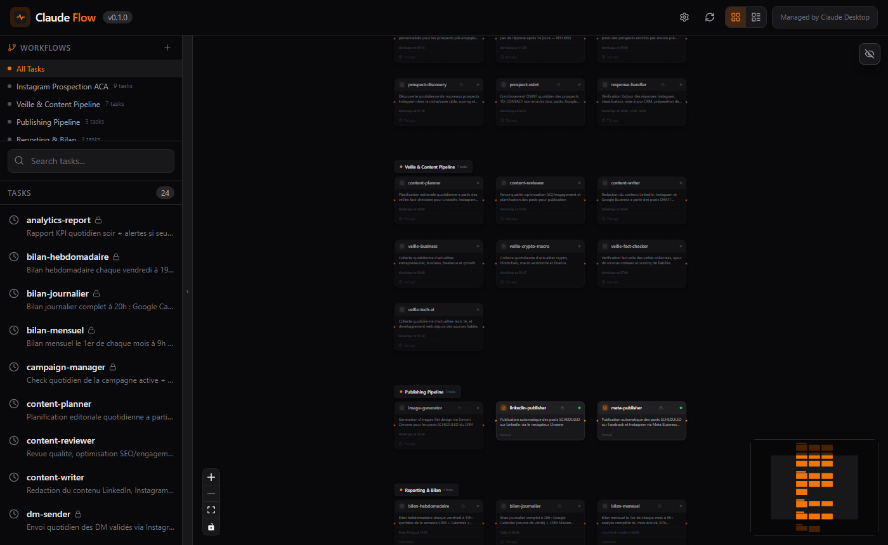
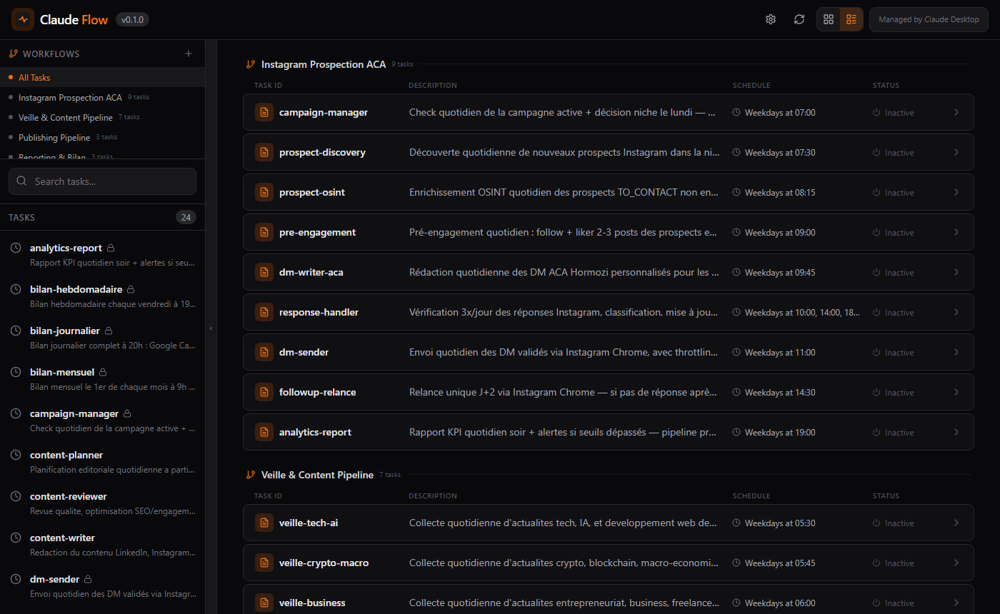
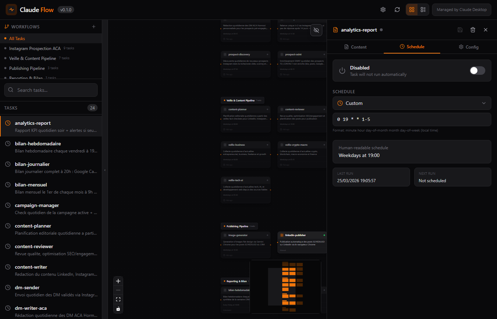
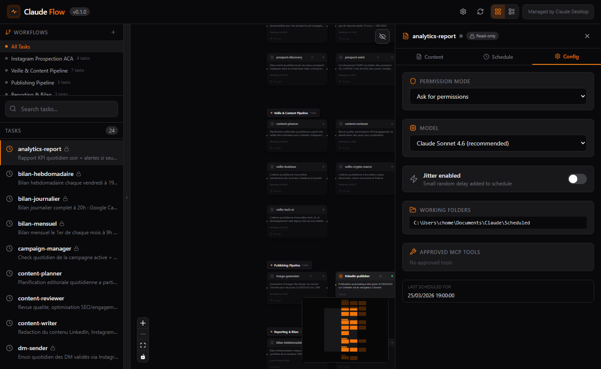

<div align="center">


# Claude Flow

**Visual workflow manager for [Claude Desktop](https://claude.ai/download) scheduled tasks**

n8n-style task orchestration with a drag-and-drop canvas, real schedule data, and direct Claude Desktop config control.

[](LICENSE)
[](https://nodejs.org/)
[](https://pnpm.io/)
[](https://www.typescriptlang.org/)

</div>

---



*All your Claude scheduled tasks — grouped by workflow on a live canvas.*

---

## What is Claude Flow?

Claude Flow gives you a unified dashboard to manage, connect, and monitor all your Claude Desktop scheduled tasks. Build multi-step automation pipelines by wiring tasks together on a visual canvas, configure permissions and AI models per task, and inspect real schedule data synced directly from Claude Desktop.

## Features

### Visual Canvas & Workflows

- **Drag-and-drop canvas** powered by React Flow — arrange tasks as nodes, connect them with edges, and build automation pipelines visually
- **Auto-layout** — workflows with edges auto-generate hierarchical node positions via topological sort; no manual placement needed
- **Grouped "All Tasks" view** — bird's-eye view of your entire automation system with labeled workflow sections
- **Conditional edges** — connect tasks with `always`, `on-success`, or `on-failure` conditions; right-click any edge to change it
- **Minimap** — toggle a minimap overlay for navigating large canvases
- **Collapsible sidebar** — maximize canvas space; sidebar shows task counts, search, and add/remove per workflow



*List view: all workflows and tasks with schedule columns and status badges.*

### Task Editor

Three-tab editor that opens alongside the canvas:

| Tab | What it does |
|-----|-------------|
| **Content** | Edit the SKILL.md prompt and description with Ctrl+S quick save |
| **Schedule** | Toggle enable/disable, pick a cron preset or enter custom expression, see last/next run |
| **Config** | Change permission mode, AI model, jitter, working folders, approved MCP tools, allowed Chrome domains |



*Schedule tab: real cron data synced from Claude Desktop, human-readable description, last & next run.*



*Config tab: permission mode, model selection, jitter toggle, working folders, and "Last Scheduled For" from real Claude Desktop data.*

### Schedule & Sync

- **Real schedule data** — imports cron expressions, `lastRunAt`, `lastScheduledFor`, and `nextRunAt` directly from Claude Desktop's `scheduled-tasks.json`
- **Human-readable descriptions** — auto-generates labels like "Weekdays at 09:00", "1st of each month at 10:00", "Mon & Thu at 14:00"
- **Multi-directory discovery** — scans `~/.claude/scheduled-tasks/` and any extra directories referenced in Claude Desktop config
- **Sync button** — refresh all schedule data from Claude Desktop in one click

### Claude Desktop Config Control

Edit task settings that write directly back to `scheduled-tasks.json`:

- **Permission mode** — Ask / Auto-accept / Plan mode / Skip all
- **Model** — Claude Opus 4.8, Sonnet 4.6 (recommended), Haiku 4.5
- **Jitter** — disable for precise scheduling, keep on for distributed load
- **Chrome Allowed Domains** — view which domains are approved for Chrome mode tasks
- **Working folders** and **approved MCP tools** — read-only visibility

### Workflow Management

- **Auto-detect** — new tasks from Claude Desktop appear automatically; unassigned tasks are flagged
- **Auto-organize** — groups tasks by naming prefix (e.g. `veille-*`, `bilan-*`) and offers one-click workflow creation
- **Workflow variables** — define key-value env vars per workflow, synced to `~/.claude-flow/envs/{workflowId}.env`
- **Duplicate workflows** — clone a workflow with all its positions and edges

---

## Quick Start

### Prerequisites

- [Node.js](https://nodejs.org/) ≥ 18
- [pnpm](https://pnpm.io/) ≥ 8
- [Claude Desktop](https://claude.ai/download) with at least one scheduled task

### Install & run

```bash
git clone https://github.com/clementg91/claude-flow.git
cd claude-flow
pnpm install
pnpm build
pnpm dev
```

Open [http://localhost:3710](http://localhost:3710) — Claude Flow is served on a single port.

### Development (hot-reload)

```bash
# Terminal 1 — server with watch mode
pnpm dev

# Terminal 2 — web with HMR (optional, for faster frontend iteration)
pnpm --filter @claude-flow/web dev
```

The web dev server at `:5173` proxies `/trpc` to the server at `:3710`.

---

## Configuration

Claude Flow stores its config at `~/.claude-flow/config.json`:

```json
{
  "tasksDirectory": "~/.claude/scheduled-tasks",
  "port": 3710,
  "workflows": []
}
```

| Field | Description |
|-------|-------------|
| `tasksDirectory` | Primary directory for Claude Desktop scheduled task SKILL.md files |
| `port` | Server port (default 3710; requires restart to change) |
| `workflows` | Saved workflow definitions (positions, edges, variables) |

Additional task directories are auto-discovered from Claude Desktop's `scheduled-tasks.json`.

---

## Architecture

```
claude-flow/
├── packages/
│   ├── core/        # Parser, scanner, schedule sync, config read/write
│   ├── server/      # Fastify + tRPC API (port 3710), static file serving
│   └── web/         # React 19 + Vite 6 + @xyflow/react + Zustand
├── apps/
│   └── cli/         # CLI entry point
├── package.json     # pnpm workspace root
└── pnpm-workspace.yaml
```

### Tech Stack

| Layer | Technology |
|-------|-----------|
| Frontend | React 19, Vite 6, @xyflow/react 12, Zustand 5 |
| Styling | Tailwind CSS 3 (dark theme, Claude orange accents) |
| API | Fastify 5, tRPC 11 (end-to-end type-safe RPC) |
| Data fetching | TanStack Query 5 (via tRPC) |
| Monorepo | pnpm workspaces |
| Language | TypeScript throughout |

### Data Flow

```
Claude Desktop
  scheduled-tasks.json
         │ sync
         ▼
   @claude-flow/core
  (parser · scanner · claude-sync · schedule-cache)
         │ tRPC
         ▼
   @claude-flow/server  ←→  ~/.claude-flow/config.json
   (Fastify + tRPC)
         │ HTTP / tRPC
         ▼
   @claude-flow/web
  (React Flow canvas · Zustand store · TanStack Query)
```

---

## API Reference

The server exposes a tRPC API at `/trpc/*`:

| Router | Procedures |
|--------|-----------|
| `tasks` | `list`, `getById`, `create`, `update`, `delete`, `checkId` |
| `workflows` | `list`, `getById`, `create`, `update`, `updateLayout`, `updateVariables`, `duplicate`, `delete`, `autoLayout`, `suggestFromTasks` |
| `schedule` | `getAll`, `getByTaskId`, `updateLocal`, `syncFromClaudeDesktop`, `syncFromMcp` |
| `settings` | `get`, `update` |
| `claudeDesktop` | `getTaskConfig`, `updateTaskConfig`, `listAvailableModels`, `getDiscoveryDiagnostics` |

---

## Compatibility Notes (Claude Desktop / Claude Code / MCP)

- **Claude Desktop & Claude Code sessions** — Claude Flow scans Claude's session folders for `scheduled-tasks.json` files and merges task metadata across sessions.
- **Future session types** — Any Claude session directory ending in `-sessions` is discovered automatically, so newer agent runtimes can be picked up without code changes.
- **Config roots searched** — Claude Flow checks `~/.claude` plus platform-specific Claude config roots; on Linux it supports both `Claude` and `claude` casing under `XDG_CONFIG_HOME` or `~/.config`.
- **Custom config root** — Set `CLAUDE_CONFIG_DIR` to point Claude Flow to a non-standard Claude configuration directory.
- **MCP sync** — You can still push authoritative schedule data from MCP with `schedule.syncFromMcp`; Claude Flow merges this with existing local schedule cache entries.
- **Diagnostics** — Use `claudeDesktop.getDiscoveryDiagnostics` to inspect config roots, detected session directories, and discovered `scheduled-tasks.json` files.
- **Model discovery** — `claudeDesktop.listAvailableModels` is derived from models currently found in Claude schedule files (with fallback defaults when none are detected).

## Development

```bash
pnpm build        # Build all packages (core → server → web)
pnpm test         # Run core unit tests (58 tests)
pnpm lint         # ESLint across all TypeScript/TSX files
pnpm clean        # Remove all dist directories
```

---

## Roadmap

- [x] Auto-layout workflows from edges (topological sort)
- [x] Auto-detect unassigned tasks and suggest workflows
- [x] Grouped "All Tasks" view with workflow headers
- [x] Collapsible sidebar with add/remove per workflow
- [x] Real schedule data from Claude Desktop (cron, lastRunAt, lastScheduledFor)
- [x] Chrome Allowed Domains visibility in Config tab
- [x] Multi-directory task discovery
- [x] Workflow environment variables (.env per workflow)
- [ ] Smart cron suggestions when connecting tasks
- [ ] Task templates
- [ ] Integration with Claude Desktop execution logs
- [ ] Workflow execution engine (sequential task runs)

---

## License

[MIT](LICENSE)
